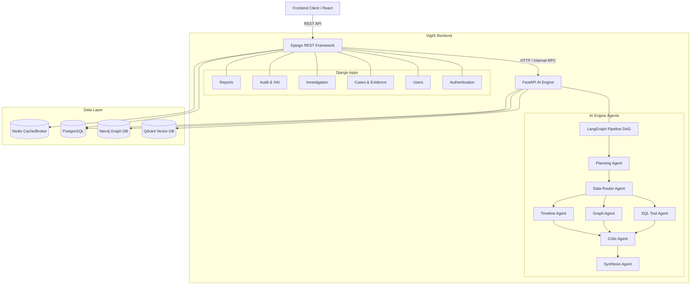

# VigilX Backend Architecture

VigilX Backend is a robust, dual-service architecture designed for complex relational data, and advanced multi-agent AI investigative pipelines.

## Architecture Diagram



## Tech Stack Overview

- **Web Frameworks:** Django (Primary API Gateway), FastAPI (AI Engine microservice)
- **API Interfaces:** Django REST Framework (DRF)
- **Data Layer:**
  - **PostgreSQL:** Primary relational database for users, cases, and structured evidence.
  - **Redis:** Used for caching, message brokering, and asynchronous task queues.
  - **Qdrant:** Vector database for semantic search and Retrieval-Augmented Generation (RAG).
  - **Neo4j:** Graph database for mapping complex criminal networks and suspect relationships.
- **AI & Automation:** LangGraph (for multi-agent DAG pipelines).
- **Integrations:** Zoho Catalyst SDK for advanced enterprise SSO and integrations.

## Core Modules

### 1. Django API Server (Port 8000)
The Django server acts as the primary gateway. It handles all structured data, user management, and standard API endpoints.
- **Authentication & Users:** Manages JWT-based auth, standard email logins, and SSO (Google, Zoho).
- **Cases & Investigation:** Handles the Investigation Hub, storing case details, metadata, and workflow statuses.
- **Audit & XAI:** Tracks and logs system interactions, which is crucial for Explainable AI (XAI) auditing.
- **Reports:** Generates downloadable reports (e.g., automated PDF generation).

### 2. FastAPI AI Engine (Port 8001)
The AI Engine handles heavy computational AI workloads and is automatically spawned alongside the Django server.
- **Multi-Agent Pipeline (V2 Chat):** Uses LangGraph to orchestrate a Directed Acyclic Graph (DAG) of agents.
  - *Planning & Routing:* Breaks down complex queries and routes them to specialized tools.
  - *Specialized Tools:* SQL Agent (financial tracing), Graph Agent (network mapping), Timeline Agent (chronological ordering).
  - *Critic & Synthesis:* Reviews the output for accuracy and compiles the final comprehensive response.

## Getting Started

To run the backend servers locally:

1. Ensure your Virtual Environment is activated.
2. Run the provided batch file from the root of the backend repository:
   ```cmd
   .\run_servers.bat
   ```
This script will:
- Prompt for Redis startup preferences (WSL or Docker).
- Start the Django REST Server on `http://127.0.0.1:8000`.
- Automatically spawn the FastAPI AI Engine on `http://127.0.0.1:8001`.

## Environment Variables
Ensure the `.env` file is properly configured with your PostgreSQL connection string, Neo4j credentials, Qdrant URL, and required LLM API keys.